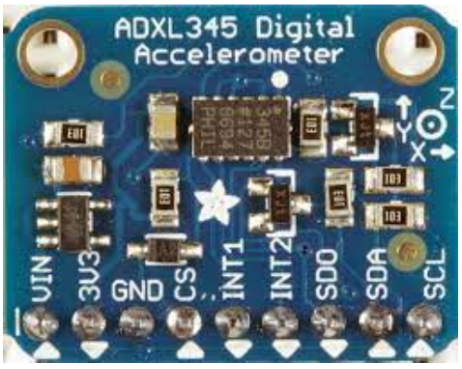
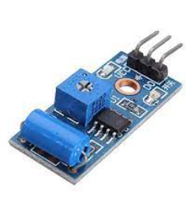
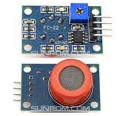
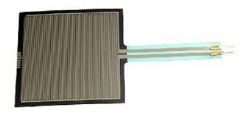
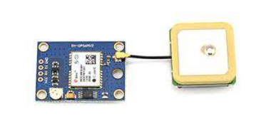
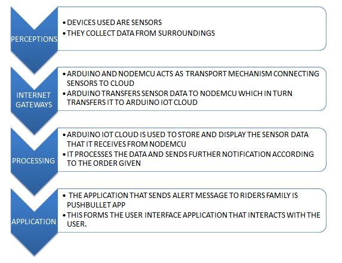
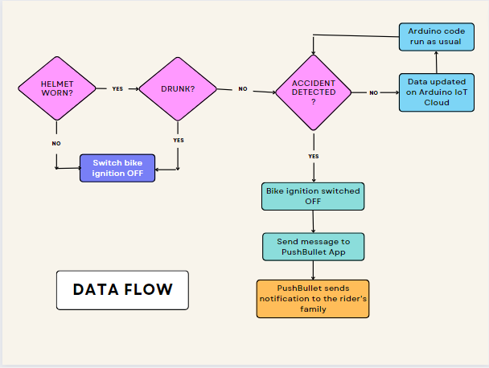

# Smart-Bike-Helmet

## Abstract

Smart Bike Helmet is a protective headgear that provides enhanced protection to the rider with advanced features such as alcohol detection, accident detection, and live location tracking. It protects the rider by not allowing the bike’s ignition to turn ON if he/she is drunk or not wearing the helmet. This is done using an RF module. Its main purpose is to detect possible accidents and notify the rider's family about the same with the current location so that help could be provided timely.

## Motivation

Our inspiration was to learn the basics of IoT, Arduino, to work with sensors and to familiarize ourselves with the various platforms that are used for IoT through this project.
 
The aim of this project is to ensure safety of the rider and prevent deaths and injuries caused by road accidents. If such a product is used on a large scale then the number of road accident related deaths and cases would be reduced. It is because it would be compulsory to wear the helmet and not be drunk in order to ride the bike. Also in case an accident occurs, the family gets notified about it along with the current loccation of the driver. Through this we want to solve two issues : reducing the number of road accidents by reducing drink and drive cases and provision of timely treatment that could otherwise prove to be fatal.

## Mechanical Aspect of the Design

The main body is a basic helmet to which various sensors are attached that gives it its functionality. An alcohol sensor has been fitted inside the helmet right in front of the mouth of the rider. Force sensitive resistor has been placed on the top so that it can sense whether the helmet is being worn or not. The rest of the sensors and microcontroller are placed inside a plastic box and secured at the back of the helmet.

## Electronic Aspect of the Design

### The sensors used are as follows:

### ADXL345 Accelerometer

The ADXL345 is a low-power, 3-axis MEMS accelerometer modules with both I2C and SPI interfaces.The sensor consists of a micro-machined structure on a silicon wafer. The structure is suspended by polysilicon springs which allow it to deflect smoothly in any direction when subject to acceleration in the X, Y and/or Z axis. Deflection causes a change in capacitance between fixed plates and plates attached to the suspended structure. This change in capacitance on each axis is converted to an output voltage proportional to the acceleration on that axis.

### Vibration Module SW-420 

A vibration sensor is a device that measures the amount and frequency of vibration in a given system, machine, or piece of equipment.Vibration sensors are piezoelectric accelerometers that sense vibration. They are used for measuring fluctuating accelerations or speeds or for normal vibration measurement.

The vibration sensor module based on the vibration sensor SW-420 and Comparator LM393 is used to detect vibrations. During no vibration, the sensor provides Logic Low and when the vibration is detected, the sensor provides Logic High.
 

### RF Module

Generally, an RF module is a small size electronic device, that is used to transmit or receive radio signals between two devices. The main application of the RF module is an embedded system to communicate with another device wirelessly.
 

### MQ-3 Alcohol Sensor

The MQ-3 is Alcohol Sensitive Sensor that is often used in a breath analyzer.An alcohol sensor detects the attentiveness of alcohol gas in the air and an analog voltage is an output reading.
 

### Force sensitive Resistor

A force-sensing resistor is a material whose resistance changes when a force, pressure or mechanical stress is applied. It is utilised to know whether the helmet is being worn or not.
 

### GPS Module

The GPS receiver measures the distance to each satellite by the amount of time it takes to receive a transmitted signal. With distance measurements from a few more satellites, the receiver can determine a user's position and display it
 

### The microcontrollers used are:

### Arduino UNO

### NodeMCU

## Software Aspect

IoT is a concept that refers to all the objects that are now connected to the internet and how they can communicate with each other or with the people around them. 
Iot architecture for our project is
 

 
 
 

Arduino IoT cloud services act as a cloud-based hosting platform connecting the NodeMCU to the cloud.
Wireless communication of messages to the rider's family are sent using PushBullet app.

## Tech Stack

## Cost Structure

<table>
<tr>
<th>COMPONENTS</th>
<th>COST(in Rs.)</th>
</tr>
<tr>
    <td>Arduino UNO (QTY-2)
    <td>
</tr>
<tr>
    <td>NodeMCU ESP8266
    <td>
</tr>
<tr>
    <td>ADXL345 Accelerometer
    <td>
</tr>
<tr>
    <td>RF Transmitter and Receiver 433Mhz
    <td>
</tr>
<tr>
    <td>NEO-6M GPS Module
    <td>
</tr>
<tr>
    <td>Force Sensitive Resistor
    <td>
</tr>
<tr>
    <td>MQ3 Alcohol Sensor
    <td>
</tr>
<tr>
    <td>Jumper Wires
    <td>
</tr>
<tr>
    <td>Bike Helmet
    <td>300
</tr>
<tr>
    <td>Vibration Sensor module 
    <td>
</tr>
</table>

## Applications

<ul>
<li>Accident prevention and real time safety system
<li>Rescue requests
<li>Provision of help in time
</ul>

## Limitations

<ul>
<li>False alarms are possible
<li>GPS module not implemented
</ul>

 

## Future Improvements

<ul>
<li>Other sensors like heartbeat monitors, and oximeters can be introduced
<li>Feedback mechanisms for the rider can be introduced
<li>Can be designed for less power consumption
<li>The microcontroller could be better placed so that it remains secure and safe from external stresses.
</ul>

 

## Team Members

<li> Bhawna Rana
<li>Sarish Nilakhe
<li> Shiva Rama Raju
<li> Rose Jethani 

 

## Mentors

<li> Nagesh Bansal
<li> Nishant Kumar

 

## References
